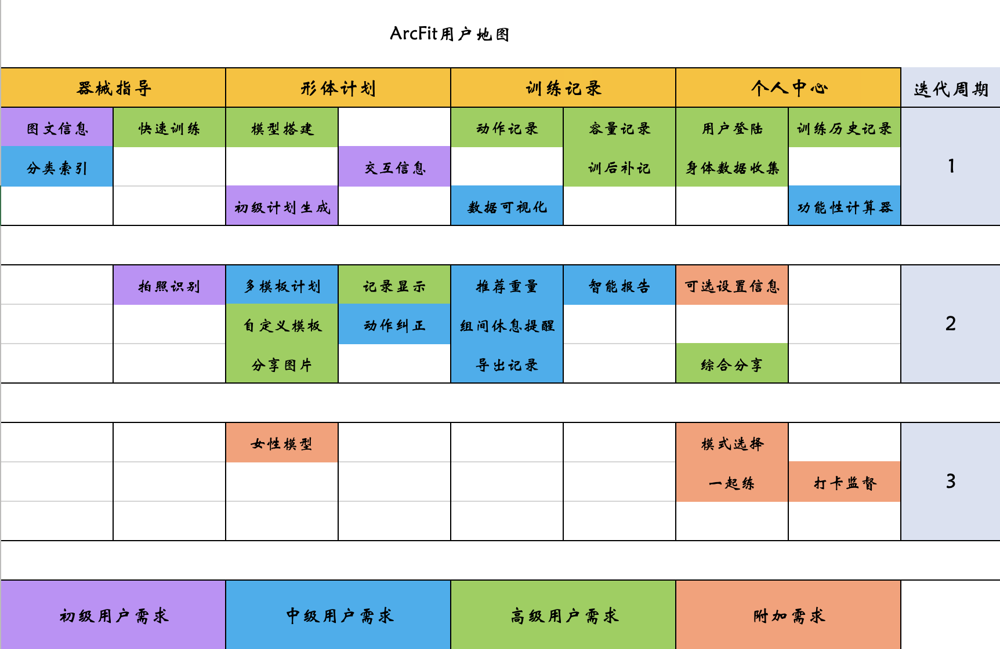
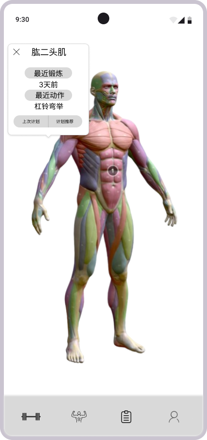
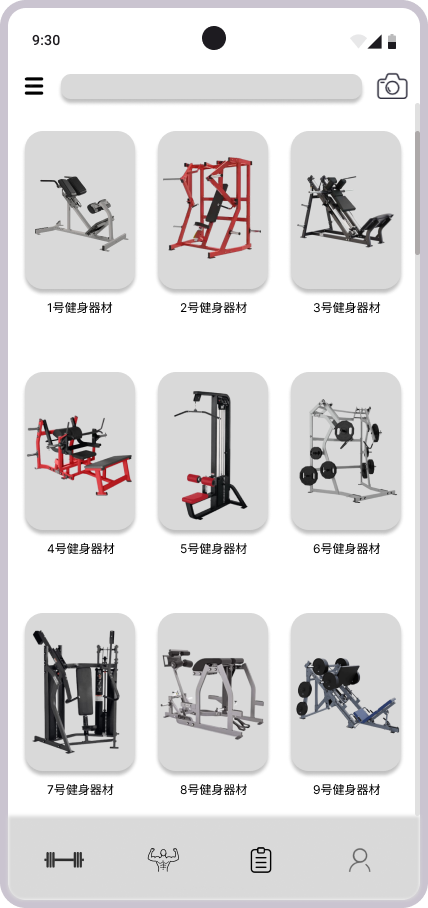
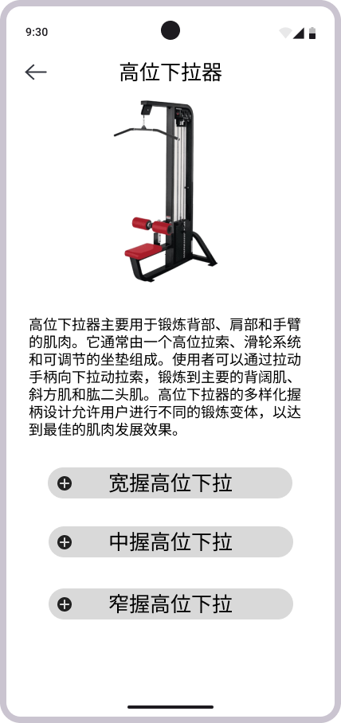
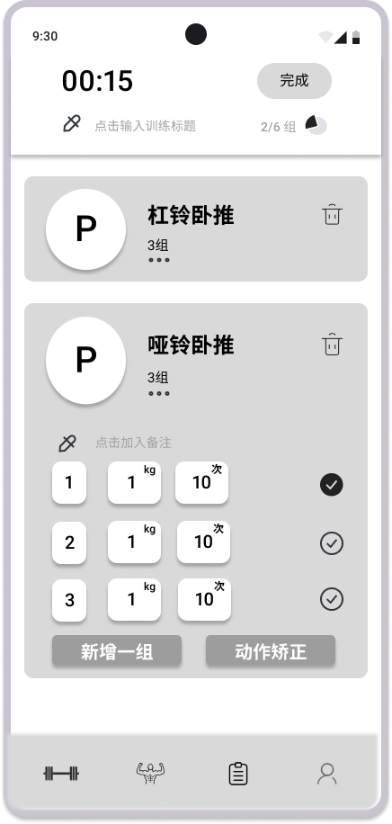
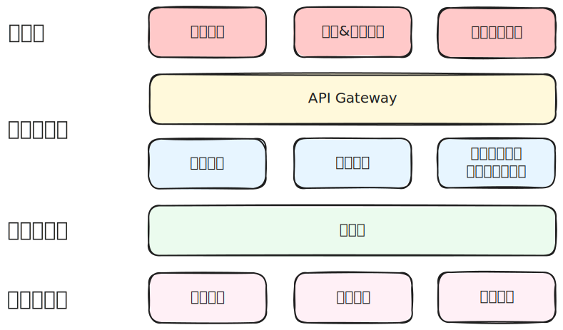

# ArcFit 需求规格书

> 姚汝昌 贾泽林 伍圣贤 韩枢辰
> 2024.10

## 一、引言

### 1 项目概述

ArcFit 是一款基于3D模型和AI的健身软件，旨在帮助用户更科学地进行健身锻炼。无论是初入健身圈的小白，还是健身房的老手，都可以通过 ArcFit 执行自己的健身计划、记录健身数据、查看数据分析报告等。ArcFit 通过人工智能技术，为用户提供更加个性化的健身计划，帮助用户更好地进行健身锻炼。从健身房器材的使用方法，到依据身体部位的健身计划，ArcFit 都能为用户提供全方位的健身指导。

### 2 项目背景

无体育，不清华。随着北体育馆的落成，越来越多的同学涌入健身房锻炼。然而，由于缺乏专业的指导，很多人在健身过程中容易出现错误的动作，导致健身效果不佳，甚至出现受伤的情况。因此，我们希望通过 ArcFit 这款软件，为用户提供更加科学的健身指导，作为你的健身搭子+私人教练，帮助你更好地进行健身锻炼。

## 二、前期调研

### 1 调研群体

ArcFit 团队在不同时间段内，前往北体育馆和综合体育馆进行线下调研，主要面向清华校内的健身人群。同时，在小红书、训记等软件上发帖，收集对现有健身软件的缺陷和期望。

本项目的调研对象主要是有意愿健身锻炼的人群，也期待能够带动更多人加入健身行列，塑造完美身材。

### 2 调研内容

- 现有健身软件的优缺点
- 用户对于健身软件的需求和期待

### 3 用户故事

- 清华大学健美队成员小岳

作为一名有着非常丰富健身经验的健美队成员，小岳希望能更好记录自己的身体状况，用最简单方便的方式记录自己的训练数据，结合身材和体脂变化，更好确定训练和饮食目标。此外，他也发现许多健身动作的细节不易掌握。因此，他希望能获得更多健身达人的经验，从专业的视角审视动作的细节，打磨自己肌肉的平衡感和线条感。此外，现在的学校健身房下午人满为患，他也希望能够智能推荐人少的时间段，避免等待。

- 三字班健身爱好者小凡

小凡同学有着非常健康的生活习惯，保持着规律的健身计划，他使用过像训记这样的健身软件，但是发现这些软件的训练记录功能并不够智能，无法根据自己的训练数据给出更好的训练建议。此外，他也发现大多健身软件的动作指导并不直观，即使锻炼这么久，也不一定能找到最好的发力点。同时，他也期待更便捷的训练操作，通过AI生成更丰富的训练模板，让自己的训练更加有趣。他也对现有软件的组间休息提醒功能不够满意，希望能结合耳机的音乐，调控自己的训练节奏。

- 北大体育馆健身新手小毛

小毛同学刚开始接触健身两周，对着知乎B站上的健身教程照猫画虎，但是每次锻炼完总是浑身酸痛，他也不知道是动作问题，还是本该如此。锻炼两周后，他甚至想着暂停锻炼，因为他觉得自己的健身效果并不明显。他想，如果有一款智能软件，可以带他快速浏览健身房的器械和使用方法，同时能够根据自己的身体情况，推荐适合自己的健身计划，那他一定会有更好的健身体验。

## 三、用户需求

### 1 健身群体典型用户

- 初次进入健身房的小白

对于第一次进入健身房的用户，他们对于健身器材的使用方法和健身计划可能一无所知。面对琳琅满目的器械，他们可能会感到无所适从。或许不认识某些器械，导致无法正确使用；或许会选用不合适的重量，导致意外的损伤；或许不知道如何制定合理的健身计划，导致健身效果不明显。因此，初次进入健身房的小白用户需要一款能够帮助他们更好地进行健身锻炼的软件。

他们需要一款从0开始的可视化健身指导软件，抛弃繁琐的文字说明，通过直观的3D模型和AI技术，为他们提供更加直观、科学的健身指导。

- 有一定健身经验的用户

即使是有一定健身经验的用户，也可能会在健身过程中出现一些问题。例如，他们可能难以找到背部发力的正确感觉，进步缓慢；又或许因为某些体态问题，无法正确完成某些动作。首先重要的是，唤起他们对于健身动作规范的意识，让他们能够更加专注于动作的细节，从而提高健身效果。结合3D模型的发力点报告，他们能够更好了解动作问题，快速调整改善动作结构。

同样，他们也需要更加智能的训练记录功能，帮助他们更好地记录训练数据，分析训练效果，从而更好地制定下一步的训练计划。此外，记录本身也应该成为一种乐趣，通过美观有趣的训练报告，可以在社交媒体上大放异彩。

- 经验丰富的健身达人

对于经验丰富的健身达人，他们可能已经有了自己的健身计划，也能够熟练地完成各种健身动作。他们更期待的是简单高效的训练记录功能，仅仅通过极少的操作，就可以够快速进入训练状态。以及在训练中更清楚的组间休息提醒，更加便捷的训练数据导出功能。

总体而言，用户健身水平越高，对于健身软件的需求点越少，更追求操作的简洁和高效。同时，不同水平段的用户对于应用的精准度和智能度的要求也不同。整体上，小白用户的需求是所有功能点的最大集合，高水平用户需要更好的体验。我们的软件设想能在最大程度上兼容多种用户需求，支持不同模式的使用。

### 2 ArcFit需求分析

通过以上说明，ArcFit 的受众主要针对初次进入健身房的小白、有一定健身经验的用户，同时期望能够满足经验丰富的健身达人。因此，ArcFit 需要具备以下功能：

- 面向健身器械的训练指导
  - 拍照识别器械和使用指南
- 人体3D模型的训练推荐和动作纠正
  - 点击人体部位推荐模板计划，支持根据器材调整
  - 动作发力点报告（用户输入，结合3D模型）结合输入
- 训练记录
  - 常规训练记录功能
    - 组间休息提醒
    - 基于以往训练记录的容量指导
  - 可视化训练数据和智能分析指导
  - 导出训练记录
  - 补充记录训练
- 一起练
  - 寻找训练搭子
  - 分享训练成果
  - 打卡监督

### 3 优先级分析

依据 ArcFit 的用户群体，按照最小可行性原则，我们将功能分为三个优先级：

- 高优先级
  - 面向健身器械的训练指导
  - 常规训练记录功能

- 中优先级
  - 人体3D模型的训练推荐和动作纠正
  - 可视化分析与智能指导

- 低优先级
  - 更多人体3D模型
  - 一起练

### 4 用户地图

依据功能设计，按照不同用户群体的需求以及技术实现难度，我们将计划分为三个迭代周期，分别实现不同优先级的功能。在本图中，从上到下分别为高、中、低优先级的功能，按照4个主体模块，不同需求按照色块区分。

## 四、原型设计

采用 Figma 设计原型，实现了 ArcFit 的主要功能模块，包括器械指导、形体计划、训练记录、个人中心等。

Figma 原型链接：[ArcFit 原型](https://www.figma.com/design/ZoESjWRlLiXyqdR8nvSmIU/%E5%81%A5%E8%BA%ABapp?node-id=0-1&t=s4qHzg4stx3B1ZWU-1)

以下是部分页面的设计效果图：

{width=50%}

这个页面是 ArcFit 的主界面（下图），主体是人体的肌肉3D模型，支持用户对模型进行旋转等操作。默认人体不同肌群模块会按照最近一次训练的强度显示颜色，用户可以通过点击不同部位，查看该部位的训练信息。下图以点击模型的肱二头肌为例，展示弹窗的效果，包括该部位的训练信息、历史记录等，用户可以快速采用上次训练计划（直接点击“上次计划”按钮），也可以查看更多训练方案（这会将弹窗转为新页面）。

{width=50%}

这个页面是 ArcFit 的器械指导页面。主界面是一个器械列表，用户可以通过点击器械查看详细的使用指南。左上角是一个分类索引，用户可以依据训练部位等信息筛选器械；正上方是一个搜索栏，用户可以通过搜索器械名称快速查找；左上角是拍照识别按钮，支持用户通过拍照识别器械。

用户在点击某器械后，会进入器械的详细页面（下图），包括器械的使用方法、注意事项等信息。为方便用户添加训练，以上文字和视频也可以被折叠。页面的下方是利用该器械的常见动作，用户可以通过点击动作查看详细的动作指导，也可以快速点击添加到训练计划。左上角有返回按钮，用户可以返回器械列表。

{width=50%}

这个界面是 ArcFit 的训练记录页面。主界面是用户的训练记录列表，默认页面实时显示训练进行状况，也支持训练结束后补充记录。在本页面中，已完成的动作会在上方显示，未完成的动作会在下方显示。主要框栏中显示了正在进行的训练动作，包括基本信息（如重量、次数等）和倒计时。值得指出的是，用户可以点击“动作纠正”按钮，进入动作纠正页面，这个界面依托于3D模型，用户可以在Page1的模型上点击自己的发力感觉点，系统会根据用户的输入，结合语言模型的分析，给出动作的改进建议。

{width=50%}

在“我的”界面中，用户可以进行个人信息的设置，包括身体数据的收集、功能性计算器的使用、可选设置信息的修改、模式选择等。在这个界面中，用户可以查看自己的身体数据，包括体重、身高、体脂率等信息，也可以通过功能性计算器计算自己的BMI、BMR等信息。在可选设置信息中，用户可以选择自己的健身模式，包括健身目标、训练强度等信息。在模式选择中，用户可以选择自己的健身模式，包括健身目标、训练强度等信息。此外，也计划支持“一起练”按钮，将设计新的跳转界面，用户可以寻找训练搭子，分享训练成果，打卡监督等。

{width=50%}

## 五、技术框架

### 1 技术选型

+ 前端：
  + 页面构建：React Native (with Expo)
  + 数据交互：AJAX
+ 后端
  + 业务框架：Django
  + 数据库：MySQL
  + 部署容器：Docker
+ 代码仓库：Github

### 2 结构设计

{width=80%}

### 3 技术难度

按照 ArcFit 的功能模块分类，我们对不同功能的技术难度进行了评估：

- 器械指导
    - 图文信息展示：简单
    - 分类索引：简单
    - 快速导入训练：简单
    - 拍照识别：困难

- 形体计划
    - 3D模型搭建：困难
    - 3D模型交互：困难
    - 初级计划生成（利用开源模型）：中等
    - 记录显示：中等
    - 自定义计划生成：简单
    - 动作纠正：困难
    - 图片分享：简单

- 训练记录
    - 动作记录：简单
    - 容量记录：简单
    - 补充记录：简单
    - 数据可视化：中等
    - 数据分析：中等
    - 组间休息提醒与计时：中等

- 个人中心
    - 身体数据收集：简单
    - 功能性计算器：简单
    - 可选设置信息：中等
    - 模式选择：中等
    - 一起练：中等

### 4 代码规范

#### 前端代码规范

- HTML 代码规范
    - 采用HTML Living标准，使用语义化标签，属性按照特定顺序排列。在缩进方面，使用两个空格，并保持整个项目的一致性，对于无内容的标签，采用自闭合形式。
- CSS 代码规范
    - 选择器命名遵循BEM命名法则和CSS Specifications模块规范。编写样式时，按照位置、盒模型、排版、视觉的层叠顺序进行，同时使用CSS变量或预处理器变量管理颜色、字体等进行全局样式调整。
- JavaScript 代码规范
    - 遵循ECMAScript规范，使用ES6+语法，变量和函数命名采用小驼峰命名法，以提高可读性。复杂逻辑部分应加入注释，以帮助理解，同时模块化代码避免全局命名空间污染。

#### 后端代码规范

- Python 代码规范
    - **导入顺序**：标准库、第三方库、自定义模块，按字母顺序排列。
    - **函数和变量命名**：使用小写字母和下划线。
    - **类命名**：使用大驼峰命名法。
    - **注释**：复杂逻辑应加入注释，文档字符串应清晰描述函数和类的功能。

- Django 设置规范
    - **配置文件**：使用 `settings.py` 分离配置，敏感信息应放入环境变量。
    - **中间件顺序**：根据功能依赖顺序排列。

- 其他规范
    - **静态文件管理**：使用 Django 的静态文件管理功能，保持目录结构清晰。
    - **代码格式化**：使用 `autopep8` 进行代码格式化，保持一致性。

### 5 项目管理

本项目采用 GitHub Actions 作为自动化工具，以提升代码质量、简化部署流程，并实现持续集成（CI）和持续交付（CD）。以下是具体的管理流程和步骤：

- CI/CD 流程
    - 持续集成：每当代码推送到主分支或创建拉取请求时，GitHub Actions 会自动触发构建和测试流程。
    - 依赖安装：自动安装 Django 和 React 项目的所有依赖项。
    - 运行测试：执行 Django 后端的单元测试以及 React 前端的测试，确保代码在合并前通过所有测试用例。
- 自动化构建与部署
    - 构建 React 应用：在测试通过后，自动构建 React 应用生成静态文件。
    - 部署 Django 后端：使用 gunicorn 启动 Django 应用，并通过 Nginx 进行反向代理。
    - 环境管理：通过 GitHub Secrets 管理敏感信息（如数据库连接字符串、API 密钥等），确保安全性。
- 代码质量检查
    - 风格检查：在每次提交时，自动运行代码风格检查工具（如 flake8 和 ESLint），确保代码符合团队的编码规范。
    - 依赖项审计：定期检查并更新依赖项，以避免安全漏洞。
- 版本管理与发布
    - 自动版本管理：根据提交信息自动更新版本号，并在发布时生成相应的发布说明。
    - 容器化：构建 Docker 镜像并推送至容器注册表，以便于在生产环境中部署。

## 六、组员分工

### 总体原则

- 数据收集： 姚汝昌 贾泽林 伍圣贤 韩枢辰
- 前端设计： 姚汝昌 贾泽林 伍圣贤 韩枢辰
- 前端界面： 伍圣贤 韩枢辰
- 后端逻辑： 姚汝昌 贾泽林
- 交互设计： 姚汝昌 贾泽林
- 项目管理： 贾泽林
- 文档编写： 姚汝昌
